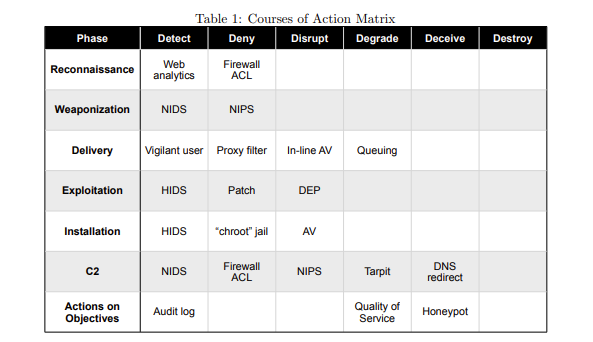
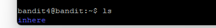

*   Week 1: Warm up
*   Week 2: Sniff-n-Scan
*   Week 3: The Lab Kid
*   Week 4: Totally legit certificate!
*   WEEK 5: INJECTED SEQUEL
*   WEEK 6: AAAATTACK!!!
*   WEEK 7: NO HASH HASH

## Short summary of this week.

**Techniques:** Passive reconnaissance, OSINT, Google dorking, basic SQL injection, network scanning fundamentals
**Tools & Platforms:** Linux (Kali), Nmap, Google Search, PortSwigger Web Security Academy, Bandit (OverTheWire)
**Focus:** Reconnaissance theory, attacker mindset, kill chain understanding, signal vs noise in early-stage discovery

## Why This Matters 

This week I focused on intelligence-driven network defense and understanding more about adversary campaign thinking, which is critical for defending against advanced persistent threats. The theory emphasizes how defenders can disrupt campaigns by APTs by gaining an intelligence advantage, recognizing attacker behavior patterns, and applying intelligence-driven defensive measures.

# Week 1: Hacker warm up

This week is an introduction to the world of hacking, and by virtue of learning about offense, I think it helps to build a solid
understanding of what is needed for successful cyber defense. This ethical hacking course is designed and run by PhD Tero Karvinen,
and the topics for our following weeks are designed to roughly follow the process of the cyber kill chain.

More about Tero's excellent courses @TEROKARVINEN.COM

You're welcome to join me in this great journey of learning - let's have fun!

The following are my translated and polished work reports from the course. My original reports are written in Finnish,
and I was having a little bit too much of fun writing the reports: excitement, coarse language and memes followed.

===================================================================================================


## x) The following is a short summary of the following sources:

O’Reilly, Santos et al (The art of hacking / HackerRepo.org ), 
Hutchins et al 2011 ( Intelligence-Driven Computer Network Defense Informed by Analysis of Adversary Campaigns and Intrusion Kill Chains )

Reconnaissance can be roughly divided into two parts: passive and active. Much like using sonar, active recon involves sending packets directly into the target network. In other words, it’s a 'noisy' way to probe a target, whereas passive listening and data collection remain invisible to them. 

Don't neglect passive reconnaissance, it's the foundation you will be building on top of. You can find an awful lot of valuable information from open sources. You can scout the organization and it's key personnel via LinkedIn (and OSINT), find out more about what they are working on, you can even build a dictionary for an attack scraping their blogs and available personal information.. Targeted e-mail campaigns on key personnel are a typical vector inside a company's network, coupled with a tailored PDF that hides a malicious payload. 

Don't jump straight into vulnerability scanning — it is one of the loudest of all discovery methods. To put it simply: the target will definitely know you’re there if they are even remotely awake. You can make these loud methods a lot more quiet by spreading your probes over a longer period. Instead of rattling through every option in a vulnerability scanner or a fuzzer in just a few seconds, you can stretch your reconnaissance over a much longer timeframe — even months. There's no substitute for methodical manual work in reconnaissance. 

Sometimes you might even want to get caught, so you can assess the opposition's reaction and discover if there are vigilant eyes watching for an intrusion attempt. The reverse is true for the defender, you might want to deceive and lead the intruder into your own honeypot to collect information about their tactics and procedures. Real life campaigns by APTs can last for months, even years.

## On Intelligence-Driven CDN & INTRUSION KILL CHAIN

Campaigns by advanced persistent threats (APTs) require the defenders to learn new ways to operate. Relying on old-fashioned automated tools
like antivirus is not enough, likewise it isn't enough for defenders to operate and think the conventional way: that incidents and breaches
happen because of a flaw that you can fix.

Defenders can achieve success by gathering information about the opponent's campaign. This involves kill chain analysis and gathering
information about their tactics, techniques and procedures - and the strategic campaign behind it. You can find more information about TTPs on https://attack.mitre.org/.

By gaining information advantage the defenders can disrupt the opponents cyber kill chain by implementing countermeasures faster
than the APTs operations evolve - Gathering information allows the defender to reconstruct the adversaries campaign and make predictions
by analyzing the observed patterns. As a defender with an information advantage you can even spoil opponent's zero day exploits and raise
the cost and time of their operation.

Below is a screenshot of a nice illustration of defenders courses of action.


 

Cyber Kill Chain is as follows:

1.  Reconnaissance
2.  Weaponize  ( Metasploit, tailored PDFs, Evilginx2)
3.  Delivery ( 3 very common ones are: e-mail attachments, USB sticks, web pages )
4.  Exploit ( executing your payload )
5.  Installation ( backdoors, reverse shell to gain persistence )
6.  Command and control 
7.  Action on Target

Some tools and resources:

*Port scanning*: Nmap, masscan ( especially for scanning large networks), udpprotoscanner
*Proxies*: ZAP, Burp ( Useful for lots of things, including MitM attacks to bypass MFA )
*Web application recon*: Eyewitness ( for identifying and visualizing targets)
*Fuzzing*: Ffuf
*Weaponizing*: Metasploit ( A framework for crafting and obfuscating payloads to be exploited later), 
evilginx ( MFA bypass and phishing tool) 


*Intelligence*: TTP:s https://attack.mitre.org/
https://owasp.org/www-project-top-ten/ ( Top 10 vulnerabilities right now )
https://www.exploit-db.com/ ( An archive of exploits and PoCs )


A) First warm-up was to practice Linux skills by playing a few levels of Bandit.




B) Next, we were to solve GEN Z Challenge OSINT  Geolocate 1

Reverse image search and a very Dutch-looking milieu made this task easy. I think I also made a google search
on some shops that were visible in the picture. -edit: I did not save screenshots on these tasks.

1st target identified as: Warmoesstraat, Amsterdam

I also tried to solve Geolocate 2

I quickly found out that we're in Portuguese capital, and the castle in picture is St. George's castle.
I was supposed to locate the apartment from which the picture was taken on.

-edit: I had some problems squeezing out the EXIF information from the picture. This could have been possibly used
to get the coordinates - I don't remember what was the issue, but I eventually moved to work on the next task.


C) The next task was to work on some simple SQL injection on Portswigger.

I edited +OR+1=1 in the URL. This is what happens when there's no filtering of inputs.

"https://0a09004203db05f4839b141100bc00b1.web-security-academy.net/filter?category=%27+or+1=1"


D) The next task was to install Kali or Debian. I set up Kali for a VM.

E) Port scanning 1000 most common ports on my localhost.


Host is up. All the ports are closed, and I am not running a DNS server. There's not much to tell here.

F) Scanning all the ports.

```
sudo nmap -p1-65535 localhost
```

All the ports are still closed, as I am not running any services/servers on my VM.

G) An aggressive scan

```
sudo nmap -A -p1-65535 localhost
```

Network distance 0 hops, which makes perfect sense when scanning localhost.
Identifying OS was impossible, as there were no open ports to gather information from.

-A flag is for: "Enable OS detection, version detection, script scanning, and traceroute”

H) Running SSH service and scanning -A again

I put SSH server on, nmap now recognizes the version of SSH that I'm running.
I also notice that OS detection works now as well.

Port 22 (SSH default) is open, nmap also collects the public key that I'm using.

I)  OSINT / Google dorks

Did you know, that you can make really sick Google searches? This is called Google dorking.
The search engine sees and indexes an awful lot. You can get a lot of inspiration for this from exploit-DB.com.

I tried a few google dorks, but the results were so shocking that I censored them off my original report.

A few examples for what you can discover through Google Dorking:

1) file types, such as adding filetype:env to your search.
2) words in the url, such as “inurl:”/login.aspx” intitle:”admin””

I'll leave it at this, because this is some real nightmare stuff.

-edit: You can mitigate this by 
1) robots.txt for well-behaved crawlers
2) enforce authentication to access sensitive information.
3) Even better - don't expose sensitive information at all if you don't have to.
4) Use a bastion host for admin access when applicable.
5) If you need to have a publicly accessible admin panel, it would be wise to take advantage of:
   Role-based access control or ABAC, strong authentication + MFA, input filtering and monitoring.

SOURCES: Exploit-DB.com