*   Week 1: Warm up
*   Week 2: Sniff-n-Scan
*   Week 3: The Lab Kid
*   Week 4: Totally legit certificate!
*   WEEK 5: INJECTED SEQUEL
*   WEEK 6: AAAATTACK!!!
*   WEEK 7: NO HASH HASH

### Week 2: Sniff-n-Scan
====================================================================================

The theme of this week is reconnaissance. We will continue our port scanning journey,
and we will capture and analyze the resulting traffic. We will also learn how to discover
points of interest using a technique called fuzzing. As always, the fuzzing target and the pentest course is
provided by PhD. Tero Karvinen @TEROKARVINEN.COM

### X) + A) FUZZ FASTER U FOOLS! 

Here's a quick summary of how to use ffuf.

You drive ffuf like this:
 
```
ffuf -w <wordlist> -u <target-url>/FUZZ
```

Fuzzing is very much an iterative process. It's a targeted brute force technique that leverages wordlists,
mutations and smart targeting of fuzzable objects. You can fuzz URLs, headers, parameters.. 
It's good to keep in mind that fuzzing is a very noisy technique. The key to success is to narrow down your hits:
You can focus your fuzzing by matching targets with -mX flags ( for example -mw matches word count, -mc matches HTTP
status codes ). It is also very useful to filter unwanted hits with -fX flags. ( for example -fs filters an unwanted response size,
-fw filters unwanted words, -fc HTTP status codes..)

By iterating filtering and matching you can narrow down your hits and discover internet gold.

Source and more about switches you can pull: https://linuxcommandlibrary.com/man/ffuf

Fuff is made by:

Hoikkala “joohoi” 2020,  Still Fuzzing Faster (U fool)

**

Let's get down to business! I don't know if we're going to fuzz fast today, but at least we got the target up and running.

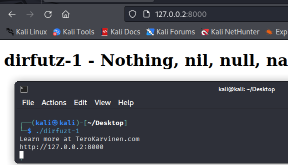

Kali Linux has ffuf pre-installed, so let's proceed to download a wordlist. Joohoi and Karvinen recommended Seclists.
You can also build your own wordlist if you want, and you can add mutations to your wordlist with Python. Some tools
like Hashcat and John the ripper can be also used to create powerful, mutated wordlists.


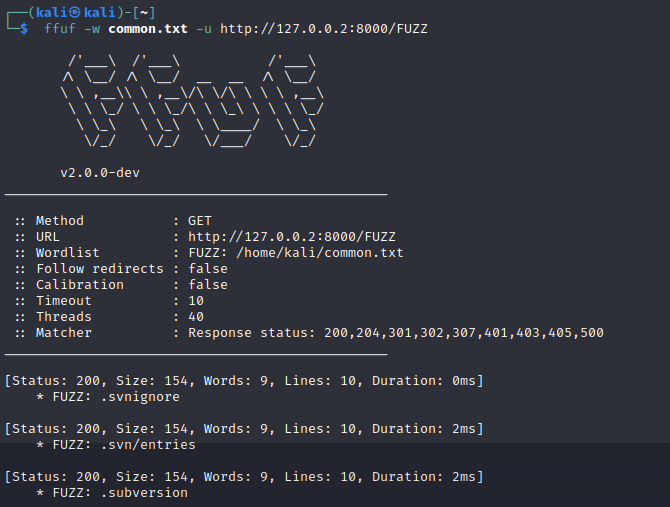

That's a lot of hits and that was fast! Let's take a quick look at some HTTP status codes for reference.

https://developer.mozilla.org/en-US/docs/Web/HTTP/Status/200

200: OK

204: no content

301: moved permanently, new url is in the location header.

302: found, new url is in the location header.

307: temporary redirect, new url is in the location header.

401: unauthorized, authentication credentials for the resource are missing. More information about the scheme in the header.

403: forbidden, the access is tied to the application logic, such as insufficient rights to a resource.

406: `Not Acceptable` "client error response code indicates that the server cannot produce a response matching the list of acceptable
values defined in the request’s proactive content negotiation headers, and that the server is unwilling to supply a default representation."

500: internal server error, Congratulations, you just messed up the server. This is potentially very interesting!
This could be because of multiple, equally interesting reasons. All in all, you likely reached a live service and messed it up in a way or another.

Allright, let's look a little bit more of what we just got. Responses with a 154 byte size show up way too often, so let's filter them away
and see what we've got after that. Below is the result after a second run.

```
ffuf -w common.txt -u http://127.0.0.2:8000/FUZZ -fs 154| less
```

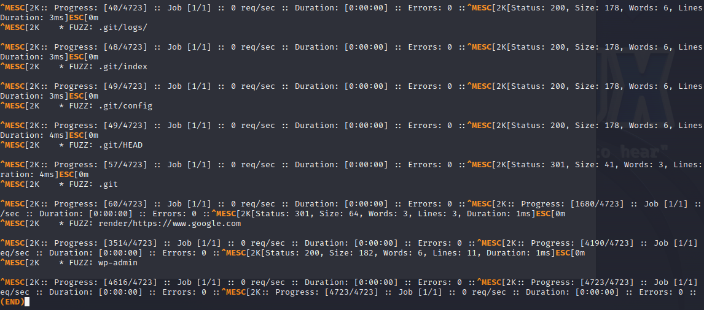

That narrowed down our hits a lot! We have so few remaining hits that we can use our own little hands and try these out manually.
Also the hits look really interesting, like wp-admin and .git/HEAD +everything else.


GOOOOAL! We found the flag! This would have been an admin portal. In a live environment this would be a prime target
for some more shenanigans. You could try some SQL injections, for example, if someone has forgot to implement filtering/sanitizing
the inputs that go to the DB behind the admin portal.

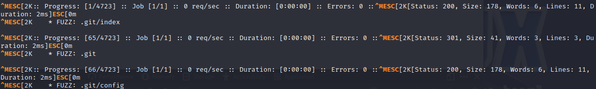

The .git hit is also extremely SUS. We have a 301 HTTP status code, so it's moved permanently.. But where's the header! I'm fumbling
my way around dev tools for a while.. 

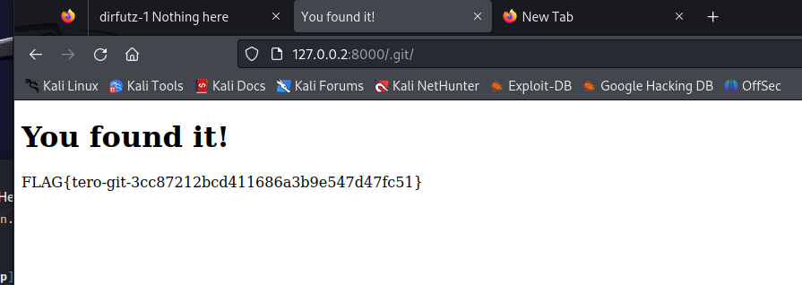

URGH! Our fuzzing hit clearly reads as follows: .git
I wasted an awful lot of time because I did not include the . in the URL. This is a little bit embarrassing, and a sign that it's a
high time to go get some sleep.

This was a very cool experience! We also would have completed this pretty quickly, if we had not made that embarrassing mistake.
Pretty sweet, mission accomplished! I also learned a lot about matching and filtering - and that you should trust your ninja senses
when fuzzing. Let's continue tomorrow with some port scanning.

========================================================================================

### X ) Port scanning basics - a summary from https://nmap.org/book/man-port-scanning-basics.html

What can we tell about the results of a port scan on a superficial level?

Port open = Port is open, which means there is usually a service running behind the port.

Port closed = Port is closed, which means there isn't a service running behind the port.
However, the packets of the scan reach the target, which means you have a machine running on the target,
and you may squeeze a little bit of information out from it


Port filtered = Scan does not get a reply from the target, this is often because of a firewall that drops the packets.
In this case it's very difficult to determine if there is a service running behind port X. 

This is what you want from firewall, as it makes reconnaissance through port scanning an exercise in futility.

Additional notes:
You can also use SPA/Port knocking to keep your ports closed - in this case you have a daemon listening to incoming
connections and opening/closing a port only when the correct trigger is received. This is pretty cool, as it hides your endpoint.

Firewalls offer some additional benefits, for example you can use your firewall to set up rate limiting ( sources, protocols.. )
and filtering to reject unwanted packets ( stateless access control lists, ports, protocols ) in order to mitigate
Denial of Service-attacks. This is unlikely going to help you a lot when facing a volumetric DdoS attack via Botnet, but it will work
when facing a smaller attack. 

A larger scale Ddos-attack can be blunted by using a cloud-based scrubbing via Cloudflare / AWS Shield / Azure Ddos protection
before the packets reach your infrastructure. You may also need to work with your ISP to drop malicious traffic at the carrier level.

Logging connections with a firewall is also a thing!


=======================================================================================


### A little bit more about specific scanning modes:

### Nmap -sS

This is a half-open scan. In this mode we will send a SYN request to our target. If our target responds with SYN-ACK, we know
the port is open and there is a service running behind the port. Our scan will respond with a RST, leaving our target with an open port
waiting for a handshake to be completed. If the port is closed, the target will reply with RST.

This kind of a scan is a relatively silent one, and may not be logged in a poorly defended target. Modern IDS/NIPS will recognize
this scan, but you can use -T0 to spread your reconnaissance over an extended period of time to hide your probing. Manual ultra-slow 
control is also possible, with --scan-delay and --max-rate.


### Nmap -sT


TCP connect scan. Unlike in our previous example, in this scan we will complete the handshake with our target and form a connection.
Since this kind of a scan is very stable ( but noisy! ) we can also use -O for OS fingerprinting and -sV for version of the service our target is running. This is highly useful, but will almost certainly be logged by our target and flagged by the IDS/NIPS.


### Nmap -sU

UDP scan. It's important to notice that UDP does not form a connection the same way as TCP. UDP does not do a handshake, and
our packets can be lost, duplicated or arrive in the wrong order, because UDP is not error correcting like TCP is.

Many services use UDP, such as DNS, DHCP, NTP, VoIP-services, streaming services, online gaming...

UDP scans can be very slow, as we don't get an immediate RST reply when a TCP port is closed. With UDP we will wait for
a timeout with ICMP port unreachable reply.


SOURCES: Lyon 2009: Nmap Network Scanning, Man-pages for Nmap 

================================================================================================
### C)  TCP connect scan

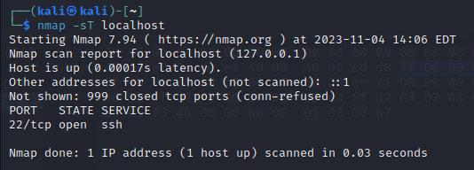

I perform a TCP connect scan on our target @localhost, where I discover a SSH service running on default port 22.

Next, let's take a look at how our TCP scan looks using Wireshark. I used a filter to show results traffic at TCP port 22.

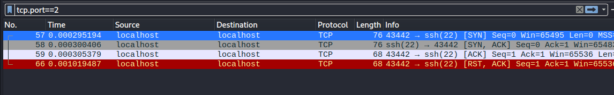

As we can see, I sent a SYN-request from an ephemereal port 43442 at our target machine running on local host port 22.
Target responds with SYN,ACK - this confirms there's a service running. Because we're using a TCP scan that forms a connection with the target machine,
we reply back with ACK, completing a three way handshake. After this, we close the connection with RST, ACK.

For comparison, below is a screenshot how the rest of the scan looked like. I scanned 1000 TCP ports, of which one was open.
Notice how we initiate a handshake with SYN on each port and get RST, ACK reply from our target. This means the ports are closed,
the target is reachable, and there is no firewall protecting the target.


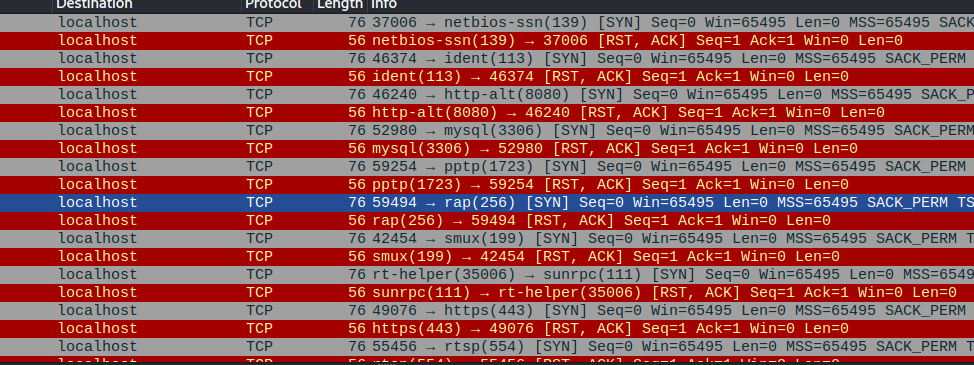


### D) TCP SYN scan

Let's move on to a TCP SYN scan.

Syn scan does not complete the three-way handshake and thus, we don't form a connection with the target. We reply to SYN,ACK from our target
with a blunt RST to terminate the handshake. Below are the results, showing that TCP port 22 is still open running SSH - all the other ports were closed,
since we got a RST reply to our initial SYN. Apparently our attacking machine is not running a DNS service, which is true! 
Nmap also informs us that there's a loopback ipv6 address on our target machine which was not scanned.

 

This is how it looked liked in Wireshark.

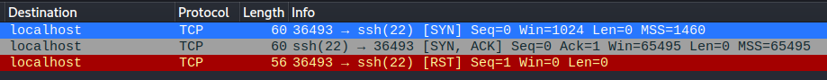


### E) ICMP ping scan

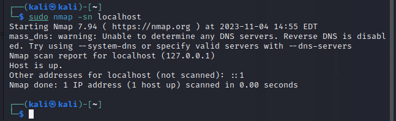

Let's move on to ICMP scan, which means we're trying to just discover if there's a machine running on our target.
ICMP messages are often ping requests ( ICMP echo and reply ) and ICMP timestamps. -edit: nmap -sn also sends ARP requests
when we're running this locally! 

Surprise, there's a live host on our target! What surprised me more is that we saw absolutely nothing in Wireshark. Talk about stealth!

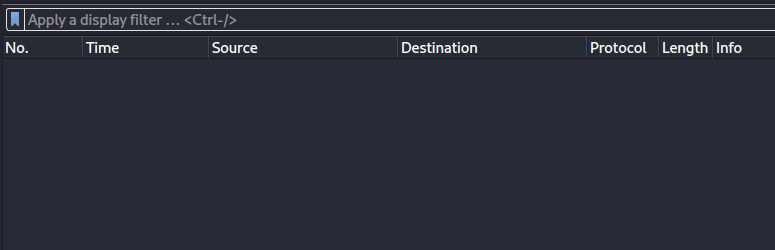

-edit: In retrospect I think this was most likely because we were filtering TCP protocol only because we used it in previous tasks.

While I was wondering the previous silence in Wireshark, I closed the sniffer and started it again. I proceeded to ping my attacking machine and
run nmap -sn again at our target machine. We're now seeing traffic in Wireshark and we get TCP RST, ACK replies from ports 80 and 443 - the ports are closed.

-late edit: I was surprised to discover the nmap also sends TCP requests when running an ICMP scan.

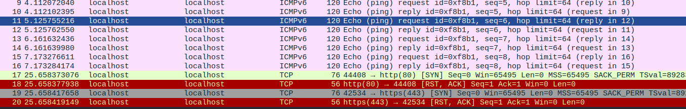


### F) Nmap -pN ( No ping )

This time we're skipping pinging, so we assume that the target is live and proceed with the port scanning regardless if we get any replies to our ICMP messages.
It is common that ICMP traffic is blocked, so -pN is often mandatory to get any scanning done on a real-life target.

Tjahas…

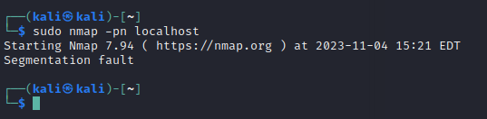

I wonder what this was about..

--late edit: Apparently this was a genuine crash!

### G) Nmap -sV

Let's try version discovery! I targeted the previously discovered open TCP port 22 that has a SSH service running on it.

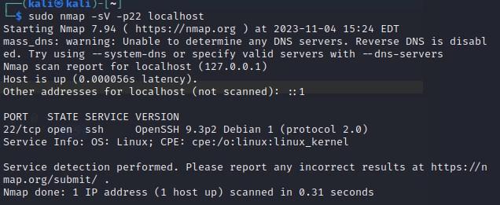

Nmap -sV identifies the SSH service beautifully! It is OpenSSH 9.3p2 for Debian

Nmap also correctly identifies target OS as Linux, and considering previous version information it's Debian.

We saw the following in Wireshark

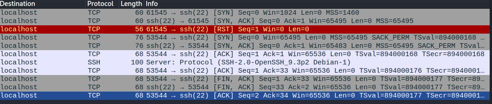

The scan started with a SYN request, the target replied with SYN,ACK, to which we replied with RST to terminate the handshake.
This was possibly done to initially verify there's a live service running on our target machine.

This was followed with a new SYN -> SYN,ACK, ACK completing a three-way handshake and forming the connection. After this, we got the version
information from our target with the SSH protocol message, after which replied with an ACK and proceeded to finalize the connection the proper way
with FIN,ACK messages being exchanged.


### H) Nmap -oA <insert\_yourlog\_here>

Next we're running nmap and directing the output to a log file of our choosing.

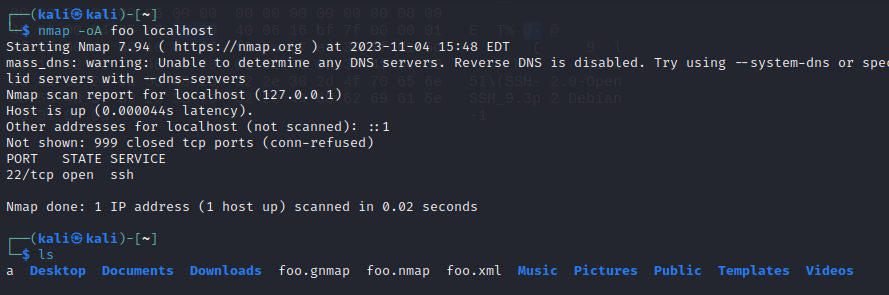

Great, we got three different versions of our output. Let's take a closer look.

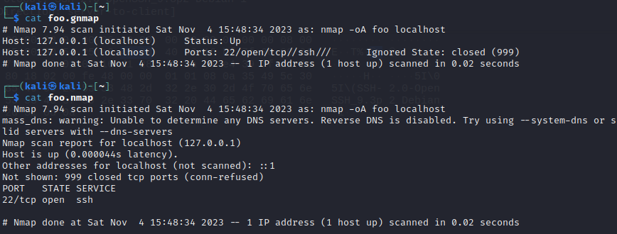

The first output foo.gnmap is a nice and short summary, very greppable form and human readable. Useful when there are a large number of hits.

The second  output foo.nmap is the regular, full report. Useful for more a more granular look.

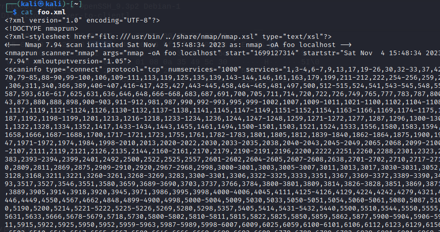

The third output is foo.xml. This one is very handy for robots, which is nice if you want to automate analyzing your results.

** I) Nmap runtime commands**

Runtime commands can be handy if you're running large, time-consuming scans.

Let's take a look at a few options.

Shift V or v: Decrease tai increase the level of verbosity. Let's try this with a little bit more time-consuming scan and try how it looks.
Let's perform an aggressive UDP scan of all ports with OS and Version detection, traceroute and script scanning enabled. 

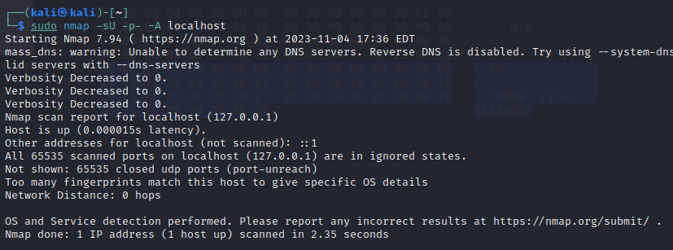

Heh, 2.35 seconds was not much time to observe the effects, but we did manage to get a very slimmed down report.


Packet tracing: Let's try a TCP NULL Scan with packet tracing enabled. This is a poverty sniffer mode.

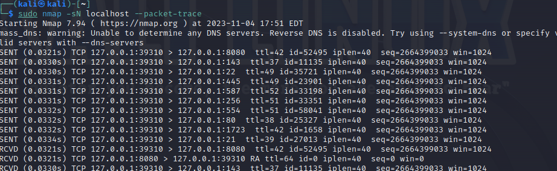

### J) Way of the samurai: Scanning a live Apache server

Let's try an aggressive scan targeting TCP port 80. I want to be intentionally noisy. I set up an Apache server on our target machine for this.

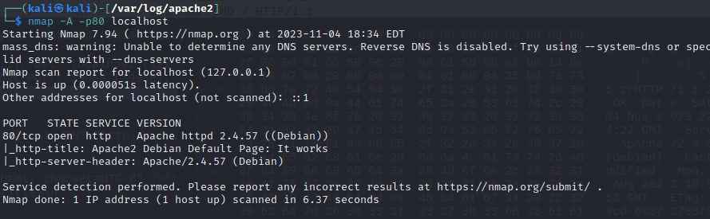

As we can see, we have Apache 2 up and live on our target serving the default "it works"-page.
Nmap also identified Apache version 2.4.57 running on Debian.

Let's take a look how our GET request and HTTP traffic looks like in Wireshark.

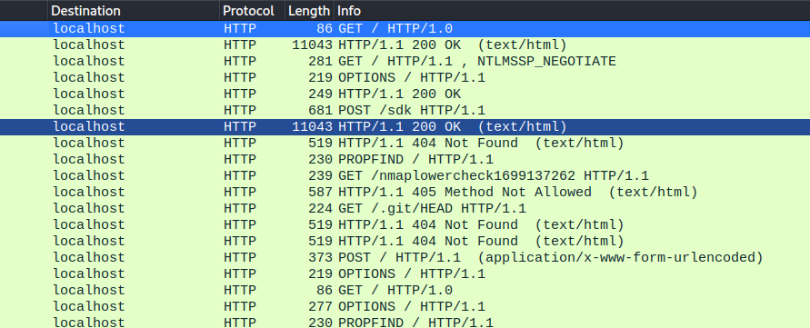


Below is a more detailed look at our captured booty. You can get a lot of detailed information out of Wireshark,
as we're capturing and recording the full traffic and we're looking at unencrypted HTTP instead of HTTPS.

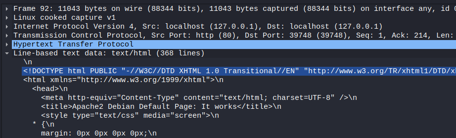

Let's take a look at how Apache logs look like. It has successfully recognized a lot of events involving Nmap scripts.
We could mitigate the scanning attempt by automating source IP banning. 

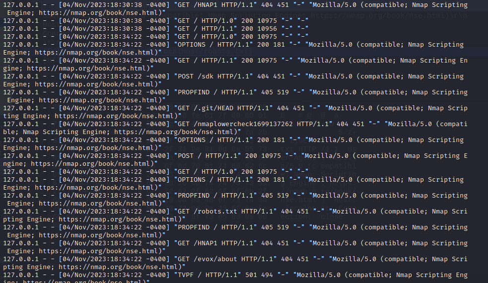

Let's try version detection next with nmap -sV


There's a lot less stuff on our Apache logs this time. We can see HTTP GET request being successfully served with code 200 OK.
We can also see Apache still recognize some nmap scripts. Version detection is noisy!

Next, I want to try if I can scan TCP port 80 like a true ninja. Let's start with removing our old Apache log and perform a
TCP SYN scan.


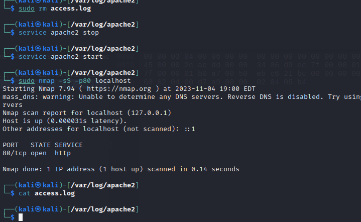

As we can see, TCP SYN scan recognized the open port serving HTTP, but Apache log file is empty! Great success.
It's to be noted that it is unlikely the previous would work as smoothly in a modern environment, IDS/NIPS will flag
and ban your IP unless you go extra stealthy and spread your scan over a long duration.

Our scan looked like this in Wireshark. SYN -> SYN,ACK -> RST to terminate the handshake before it completes.

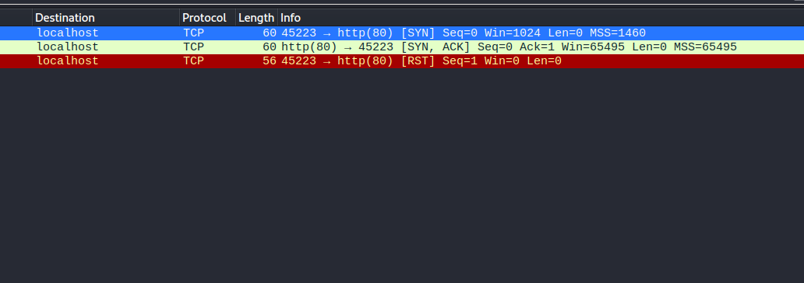

### K) UDP-scan: Destination unknown

Let's run a UDP scan on all ports.

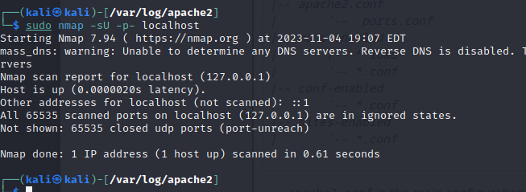


UDP is connectionless, so everything is working as intended even though we're not getting replies to our packets. This can make it
difficult to determine if a port is open or closed, since you can get a lot of false positives or negatives.

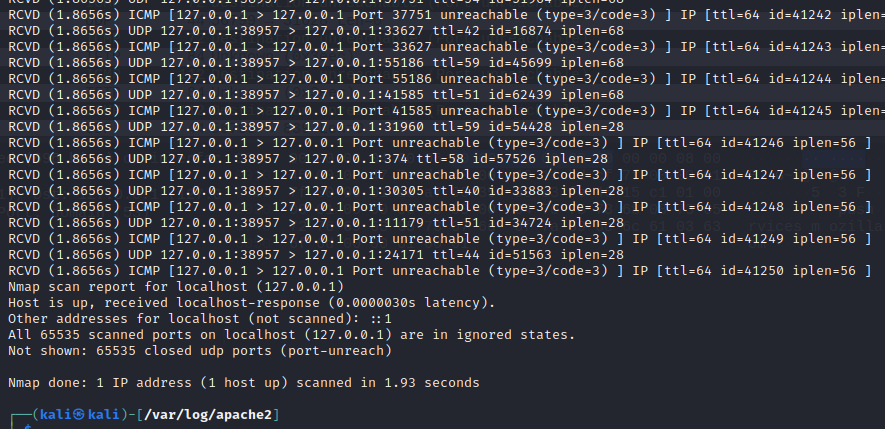

I performed packet tracing on nmap, 1 host is discovered but all the UDP ports are closed. We're also seeing a lot of ICMP Port unreachable
replies. 

That's all for this week, thanks for joining us on this learning journey. IT WAS FUN!

